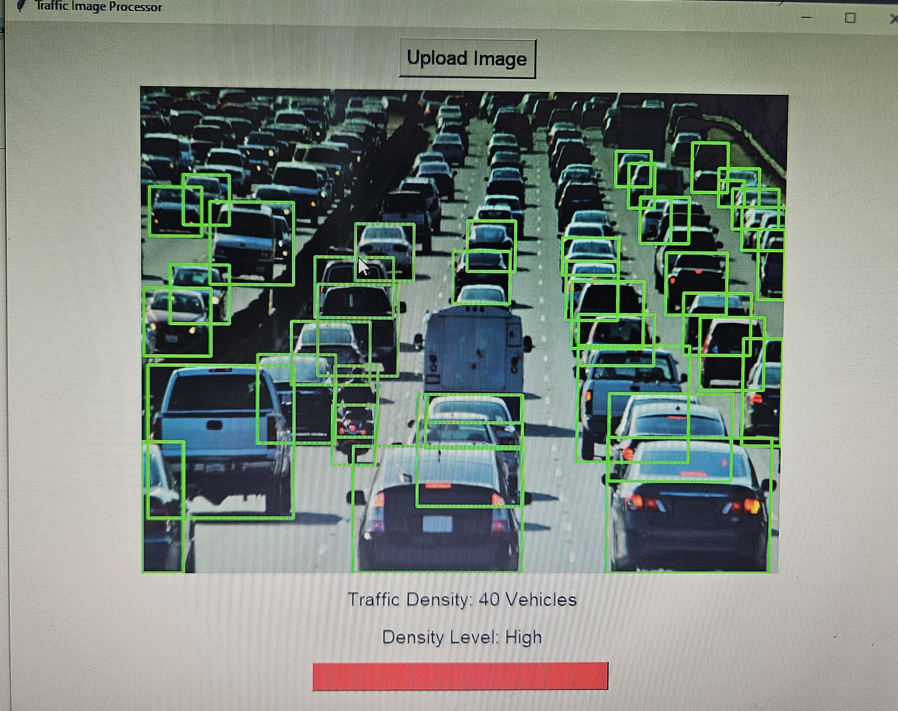

# 🚦 Traffic Image Processor & Signal Simulator


## 📌 Overview

This Python application leverages Tkinter for the graphical user interface and integrates YOLOv8 (Ultralytics) for real-time vehicle detection. It offers two primary functionalities:

1. **Traffic Image Processor**: Upload an image to detect and count vehicles, displaying the traffic density and visualizing it with a dynamic progress bar.
2. **Traffic Signal Simulator**: Simulate traffic signal cycles across multiple intersections, adjusting green light durations based on simulated traffic density.

## 🖥️ Features

- **Image Upload**: Select and process images in `.png`, `.jpg`, or `.jpeg` formats.
- **Vehicle Detection**: Utilize YOLOv8 for accurate vehicle counting.
- **Dynamic Density Visualization**: Display traffic density with color-coded progress bars.
- **Signal Simulation**: Simulate traffic light cycles with adaptive green light durations.
- **Responsive Layout**: Designed to function seamlessly on various screen sizes.

## 🛠️ Technologies Used

- Python 3.x
- Tkinter (GUI)
- OpenCV (Image Processing)
- PIL/Pillow (Image Handling)
- YOLOv8 (Ultralytics)
- NumPy (Numerical Operations)

## 📸 Screenshots



## 🚀 Installation
pip install -r requirements.txt

## Run
python TSS01.py

### Prerequisites

Ensure Python 3.x is installed on your system. Then, install the required dependencies:

```bash
pip pip install -r requirements.txt
